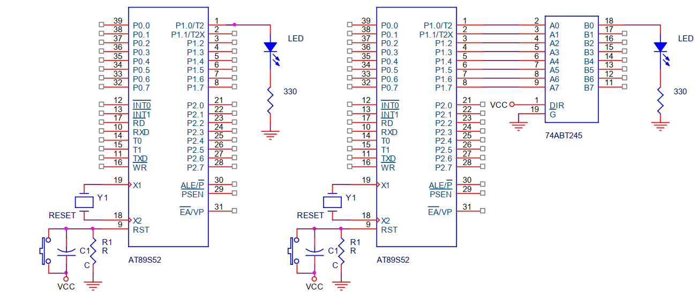
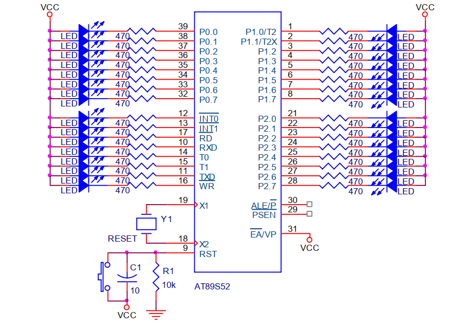
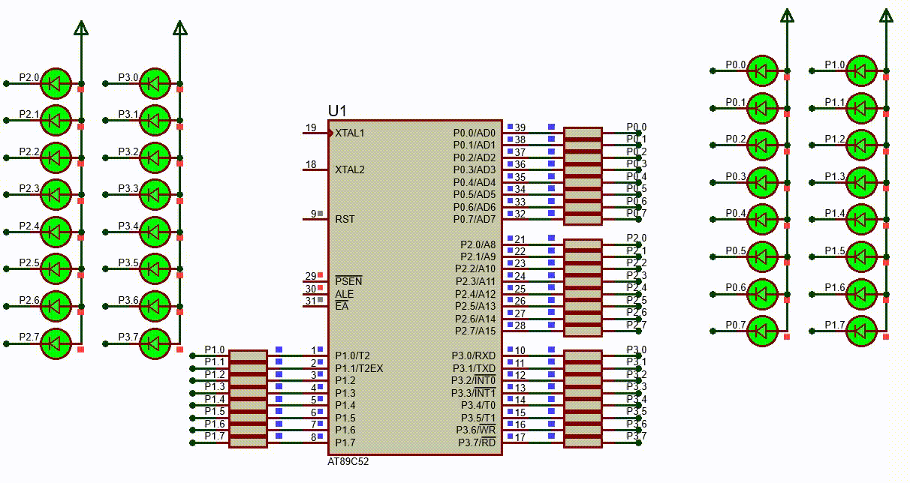
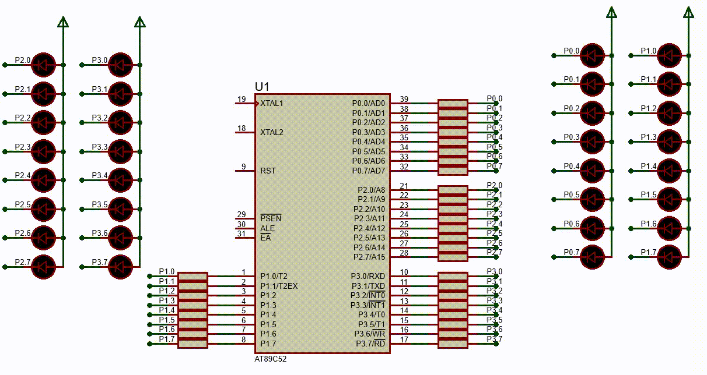
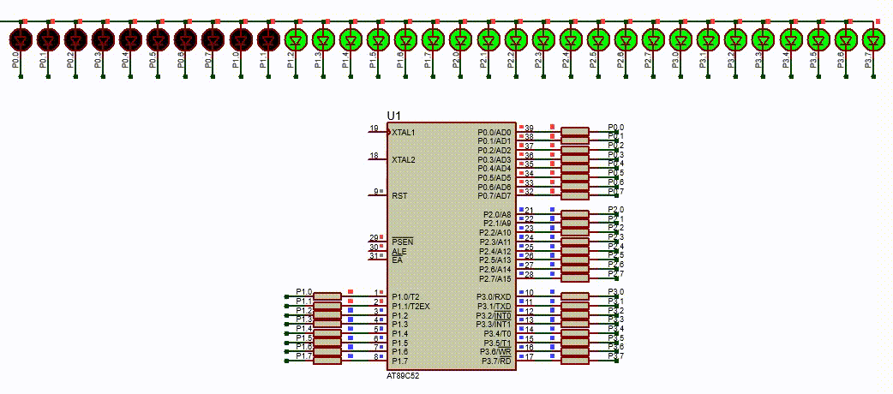
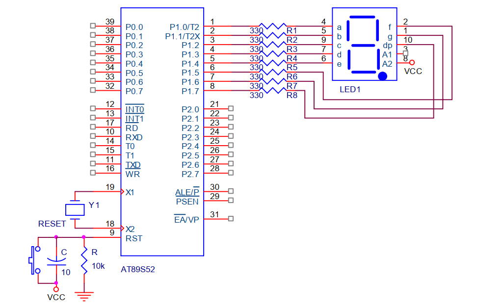
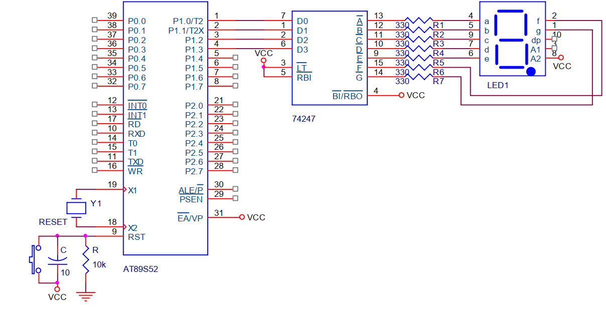

# I. Vi điều khiển giao tiếp với LED

## 1. Giao tiếp với LED đơn

### a. Giao tiếp phần cứng 

Trong các ứng dụng có sử dụng LED đơn nên phần này sẽ trình bày phần giao tiếp với LED đơn

Các thông số của LED đơn thường sử dụng là điện áp làm việc của LED khoảng 2V, dòng qua LED khoảng 10 đến 20 mA

Tra các thông số làm việc của mỗi ngõ ra của vi điều khiển thì khi ngõ ra ở mức H dòng chạy ra (soucre) có giá trị rất nhỏ khoảng từ 10 uA đến 60 uA đối với port 1, 2, 3 và dòng khoảng 80 uA đến 800 uA đối với port 0. Khi ngõ ra ở mức L dòng chạy vào (sink) khoảng 15mA đối với các port 1, 2, 3 (15mA/1port) và dòng khoảng 20mA đối với port 0 (20mA/port 0)

Khi giao tiếp với LED đơn thì sẽ có 2 kiểu giao tiếp như hình dưới đây 



Hình bên trái nối trực tiếp ngõ ra của port với LED thì mức 1 LED sáng nhưng không đủ dòng cung cấp cho LED sáng nên LED sáng mờ, nếu muốn ráng rõ thì phải dùng thêm IC đệm hoặc transistor để khuếch đại. Hình bên phải dùng IC đệm 74245 để điều khiển LED 

Hình dưới đây cũng kết nối trực tiếp ngõ ra của port với LED thì mức 0 LED sáng và đủ dòng cung cấp cho LED nên LED vẫn sáng rõ không cần IC đệm 



Điện trở hạn dòng cho LED được tính như sau:

$R=\dfrac{V_{CC}-V_{LED}-V_{OL}}{I_{LED}}=\dfrac{5V-1.8V-0.45V}{5.6mA}=491\Omega$
R=(V_CC-V_LED-V_OL)/I_LED=(5V-1.8V-0.45V)/5.6mA=491 ohm

Nên chọn loại LED ráng rõ, dòng làm việc khá nhỏ nếu điện trở hạn dòng khoảng 470 ohm
 
Chú ý: khi sử dụng VDK tùy thuộc vào kết nối ta có thể dùng hoặc không dùng điện trở kéo lên (nên dùng điện trở kéo lên cho các port), nếu trobng sơ đồ mạch không có điện trở kéo lên thì mặc định hiểu ngầm là luôn có kết nối 
### b. Thiết kế phần mềm 

#### Ví dụ 1:
Với sơ đồ nguyên lí mạch như hình sau, hãy viết chương trình điều khiển 32 LED chớp tắt 

 

```asm
  ORG 0000H 
LOOP:
  MOV P0, #00H 
  MOV P1, #00H 
  MOV P2, #00H 
  MOV P3, #00H 
  LCALL DELAY 

  MOV P0, #0FFH 
  MOV P1, #0FFH  
  MOV P2, #0FFH  
  MOV P3, #0FFH  
  LCALL DELAY 
  SJMP LOOP 

DELAY:
  MOV R6, #0FFH 
LAP:
  MOV R7, #0FFH 
  DJNZ R7, $ 
  DJNZ R6, LAP
  RET 
  END
```
#### Kết quả mô phỏng 

#### Ví dụ 2: 
Với sơ đồ nguyên lí mạch như hình sau, hãy viết chương trình điều khiển 32 LED sáng dần và tắt dần

 

```asm
  ORG 0000H
  MOV P0, #0FFH 
  MOV P1, #0FFH 
  MOV P2, #0FFH 
  MOV P3, #0FFH 
;dieu khien led sang dan
LOOP:
  LCALL DELAY
  CLR C 
  MOV A, P0 
  RLC A 
  MOV P0, A 
  MOV A, P1
  RLC A 
  MOV P1, A 
  MOV A, P2 
  RLC A 
  MOV P2, A 
  MOV A, P3
  RLC A 
  MOV P3, A 
  JC LOOP
;dieu khien led tat dan 
  LOOP1:
  LCALL DELAY
  SETB C
  MOV A, P0 
  RLC A 
  MOV P0, A 
  MOV A, P1
  RLC A 
  MOV P1, A 
  MOV A, P2 
  RLC A 
  MOV P2, A 
  MOV A, P3
  RLC A 
  MOV P3, A 
  JNC LOOP1
  SJMP LOOP

DELAY:
  MOV R6, #0FFH 
LOOP_DELAY:
  MOV R7, #0FFH
  DJNZ R7, $ 
  DJNZ R6, LOOP_DELAY
  RET
  END
```
#### Kết quả mô phỏng 


#### Bài tập: 
Hãy viết chương trình điều khiển 32 bit sáng tắt dần từ trái sang phải, phải sang trái.

```asm 
ORG 0000H
  MOV P0, #0FFH 
  MOV P1, #0FFH 
  MOV P2, #0FFH 
  MOV P3, #0FFH 
;tu trai sang phai 
LOOP:
  LCALL DELAY
  CLR C 
  MOV A, P0 
  RLC A 
  MOV P0, A 
  MOV A, P1
  RLC A 
  MOV P1, A 
  MOV A, P2 
  RLC A 
  MOV P2, A 
  MOV A, P3
  RLC A 
  MOV P3, A 
  JC LOOP
;================
  LOOP1:
  LCALL DELAY
  SETB C
  MOV A, P0 
  RLC A 
  MOV P0, A 
  MOV A, P1
  RLC A 
  MOV P1, A 
  MOV A, P2 
  RLC A 
  MOV P2, A 
  MOV A, P3
  RLC A 
  MOV P3, A 
  JNC LOOP1
;tu phai sang trai 
LOOP2:
  LCALL DELAY
  CLR C 
  MOV A, P3
  RRC A 
  MOV P3, A 
  MOV A, P2 
  RRC A 
  MOV P2, A
  MOV A, P1
  RRC A 
  MOV P1, A 
  MOV A, P0 
  RRC A 
  MOV P0, A 
  JC LOOP2
;================
  LOOP3:
  LCALL DELAY
  SETB C
  MOV A, P3
  RRC A 
  MOV P3, A 
  MOV A, P2 
  RRC A 
  MOV P2, A 
  MOV A, P1
  RRC A 
  MOV P1, A 
  MOV A, P0 
  RRC A 
  MOV P0, A 
  JNC LOOP3
  SJMP LOOP
;==================  
DELAY:
  MOV R6, #033H 
LOOP_DELAY:
  MOV R7, #0FFH
  DJNZ R7, $ 
  DJNZ R6, LOOP_DELAY
  RET
  END
```
#### Kết quả mô phỏng 
 
## 2. Giao tiếp với LED 7 đoạn 
### a. Giao tiếp với 1 LED 7 đoạn 

Trong ứng dụng chỉ có 1 LED 7 đoạn thì có nhiều cách giao tiếp vi điều khiển với LED:

- Giao tiếp trực tiếp: dùng 1 port của vi điều khiển kết nối với LED 7 đoạn loại Anode chung như hình dưới đây. Dùng 8 chân I/O

 

- Giao tiếp gián tiếp: kiểu này chỉ dùng 4 đường I/O kết nối với IC giải mã LED 7 đoạn như hình dưới đây. Dùng 4 chân I/O 

 


